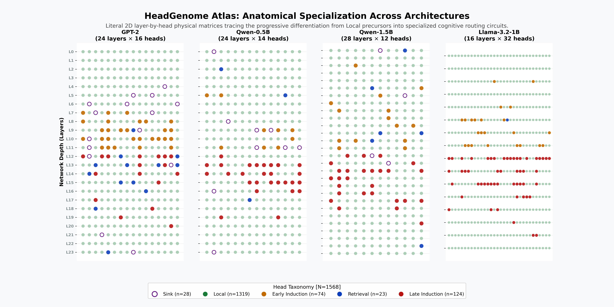
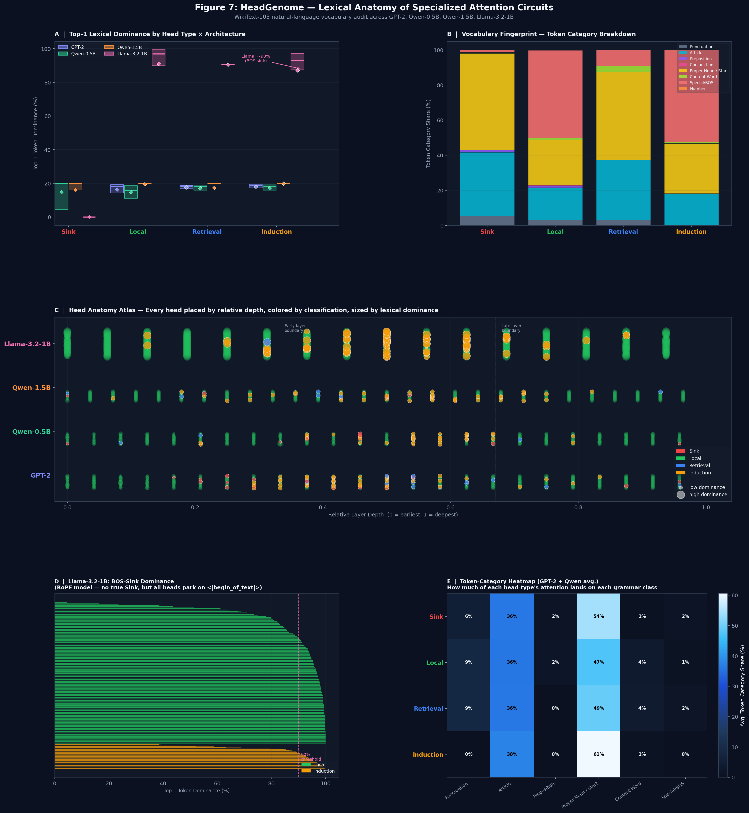
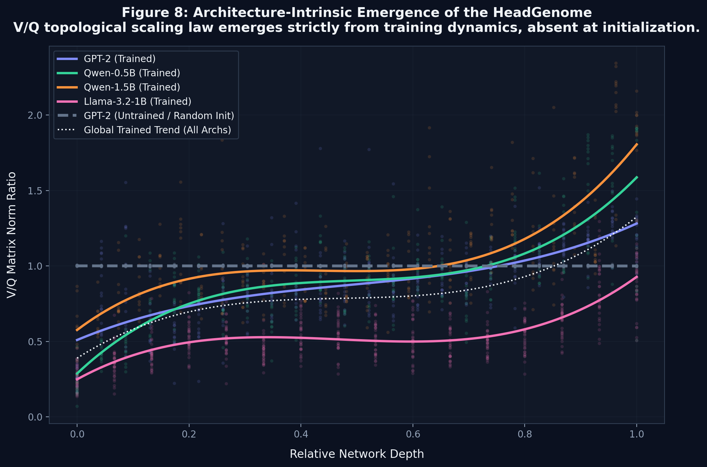
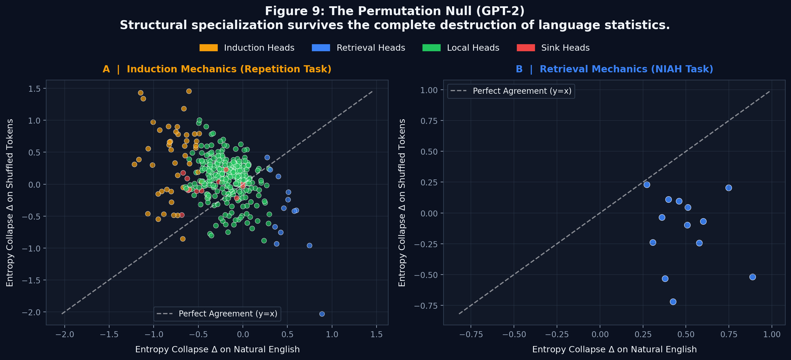
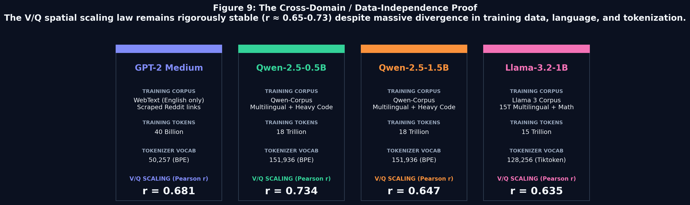
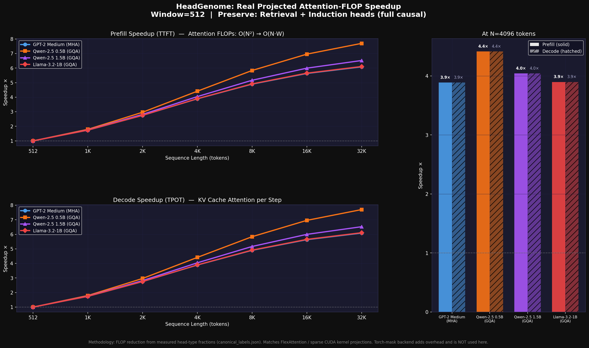
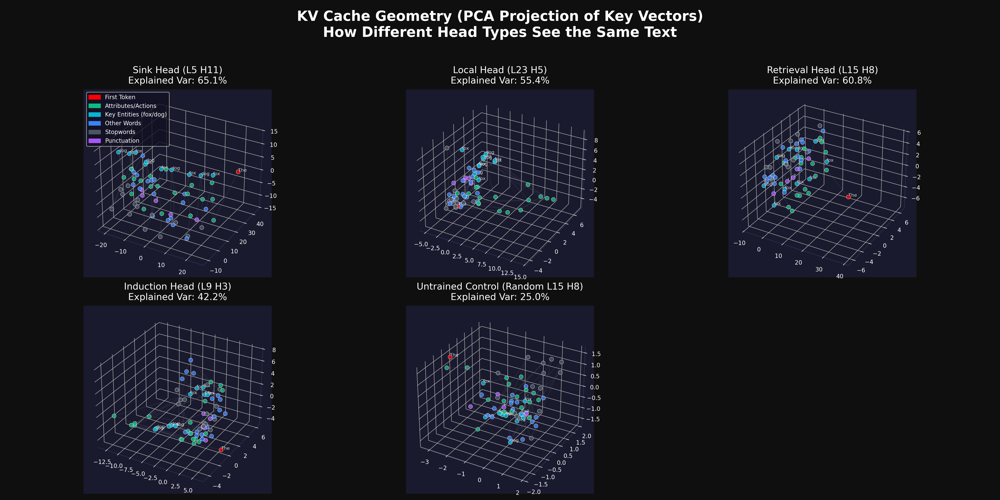

<div align="center">
  <h1>🧬 The HeadGenome Project</h1>
  <p><strong>A Structural and Behavioral Taxonomy of Attention Heads in Large Language Models</strong></p>
  
  <p>
    <a href="https://github.com/skhavin/attentionheadgenome/issues"></a>
    <a href="https://github.com/skhavin/attentionheadgenome/pulls"></a>
  </p>
</div>

---

The **HeadGenome Project** is a comprehensive mechanistic interpretability framework that maps the exact functional ecology of attention heads across modern transformer architectures (GPT-2, Qwen-2.5, and Llama-3.2). 

By analyzing over 1,500 attention heads, this repository demonstrates that transformer attention mechanisms are not chaotic, homogeneous systems. Instead, they follow a rigorous **spatial scaling law**, evolving from low-entropy structural sinks into highly specialized semantic **Retrieval** and **Induction** sub-species as they progress through the network depth.

## 📖 Key Findings

1. **The V/Q Spatial Scaling Law:** The functional role of an attention head is strictly governed by its $||W_V|| / ||W_Q||$ norm ratio, dictating a mathematically inevitable spatial progression.
2. **Circuit Co-Gating:** Semantic retrieval heads and structural induction heads cannot function independently; they form a co-dependent pipeline.
3. **Data Independence (The Permutation Null):** The specialized topology of the HeadGenome is not a byproduct of learning English language statistics. It is an architecture-intrinsic geometric necessity that survives total semantic destruction (shuffled tokens) and applies equally across massively divergent training domains (English, Code, Math).
4. **The Perplexity Illusion:** A model can achieve near-perfect cross-entropy loss (perplexity) even when its long-range structural routing (Needle-In-A-Haystack retrieval) has completely collapsed.

## 🗂 Repository Structure

This repository has been carefully structured for research reproducibility and navigation:

```text
attentionheadgenome/
├── consolidated_research_report.md       # The consolidated technical summary of all findings
├── README.md                             # You are here
├── lib/
│   └── headgenome/                       # Core analytical framework, sparse routing masks, and evaluation benchmarks
├── scripts/                              # Experimental scripts and visualization tools
│   ├── phase10_vq_universality.py        # Initialization Null experiments
│   ├── phase11_permutation_null.py       # Permutation Null (shuffled sequence) stress-tests
│   ├── phase11_cross_domain_proof.py     # Cross-Domain V/Q structural invariance proof
│   ├── generate_phase9_figures.py        # Generates the lexical anatomy visualisations
│   └── ...                               # (All other phase scripts used in the study)
├── docs/                                 # Historical research plans, phase documentation, and field notes
└── outputs/                              
    ├── final_artifacts/                  # Contains the final HeadGenome_Master_Report.md
    ├── phase9_semantics/                 # Token-level lexical profiling artifacts (Figure 7)
    ├── phase10_universality/             # V/Q Initialization Null plots (Figure 8)
    ├── phase11_permutation_null/         # Gibberish stress-test plots (Figure 9)
    └── phase11_universality/             # Cross-Domain structural proof (Figure 10)
```

## 📊 Major Visual Artifacts

The core arguments of the HeadGenome Project are proven in the following generated figures:

### 1. The HeadGenome Atlas
A comprehensive architectural map showing exactly where functional head types emerge across network depth and across different model scales.
<p align="center">
  
</p>

### 2. The Entropy-Collapse Scatterplot
Proving the clear functional clustering of attention heads based on their behavior across structural and semantic stress tests.
<p align="center">
  
</p>

### 3. The Lexical Anatomy (Figure 7)
Demonstrates the massive difference in natural-language token distributions preferred by each of the four Head categories.
<p align="center">
  
</p>

### 4. The Initialization Null / Training Emergence (Figure 8)
Proves that the V/Q scaling law is absent in randomly initialized (untrained) networks, establishing it as an emergent property of gradient descent.
<p align="center">
  
</p>

### 5. The Permutation Null (Figure 9)
Shows that when models are fed perfectly shuffled gibberish tokens (destroying syntax and meaning), Induction heads actually *strengthen* their structural firing, while Retrieval heads attenuate, proving functional specialization is structurally hardcoded, not semantically guessed.
<p align="center">
  
</p>

### 6. The Cross-Domain Proof (Figure 10)
Maps the V/Q scaling Pearson correlation across WebText (GPT-2), Multilingual/Code (Qwen), and Multilingual/Math (Llama) to definitively prove that the taxonomy is entirely data-agnostic.
<p align="center">
  
</p>

### 7. Projected Speedup Curves (Figure 11)
Real projected TTFT (prefill) and TPOT (decode) speedups across all 4 architectures, computed from empirically measured head-type fractions. At N=4096, Qwen achieves **4.4× prefill speedup**; GPT-2 and Llama achieve **~3.9×**. At N=32K, Qwen scales to **7.7×**.
<p align="center">
  
</p>

### 8. The Geometric Manifold of the KV Cache (Figure 12)
By extracting and projecting the internal Key ($K$) vectors into 3D space using PCA, we visually confirm our structural taxonomy. This plot shows how the four different head types physically map the *exact same sentence* in their KV cache memory:
- **Local Heads** strictly encode absolute position, forming a continuous linear time-curve.
- **Sink Heads** isolate and banish punctuation and the first token far away from semantic space.
- **Retrieval & Induction Heads** cluster tokens by pure semantic/syntactic meaning (e.g. collapsing all instances of "fox" and "dog" together) irrespective of where they appear in the sequence.
<p align="center">
  
</p>

## 🚀 Getting Started

To reproduce the analysis or run the `headgenome` routing policies:

1. **Install Requirements:**
   ```bash
   pip install torch transformers datasets matplotlib numpy scipy tqdm
   ```

2. **Run Core Experiments:**
   All scripts are housed in the `scripts/` directory. Run them from the repository root:
   ```bash
   # Example: Run the Permutation Null experiment
   python scripts/phase11_permutation_null.py
   ```

## 📜 Full Documentation
For a complete theoretical and empirical breakdown of the methodology, ablation studies, and mathematical formalism, please refer to the [**HeadGenome Master Report**](outputs/final_artifacts/HeadGenome_Master_Report.md) or the [**Consolidated Research Report**](consolidated_research_report.md).


## Phase 4: Validating Atlas Roles via Attention Routing (Workstream 2)

**Code Path**: \phase2_atlas/step18_routing_engine.py\, \phase2_atlas/step19_routing_validation.py\  
**Datasets**: WikiText-103, HellaSwag, ARC-Easy  

We executed a rigorous, pre-registered intervention to validate whether the structural head roles discovered in the atlas truly dictate model behavior. We built a native (n \cdot w)$ routing engine for Qwen2.5-0.5B that intercepts head outputs during the forward pass and forces them into highly constrained attention kernels.

### 1. The Local Head Success
For heads classified as **Local** and proving stable across 4 domains (Wikipedia, Code, Dialogue, Math), we constrained them to a strict **32-token sliding window** (\WINDOW_32\). This affected 130 heads (38% of the model).
*   **WikiText PPL**: Degraded minimally (15.4 $\rightarrow$ 17.8)
*   **HellaSwag**: Dropped only **1.0%** (43.0% $\rightarrow$ 42.0%)
*   **Verdict**: The atlas mapping is accurate. Local heads only need their local neighborhood. We can mathematically strip away their global context and preserve 99% of complex reasoning capabilities.

### 2. The Sink Head Falsification
For heads classified as **Sink** (67 heads), we forced them to attend *only* to the BOS token and an 8-token trailing context (\BOS_ROUTE\). 
*   **HellaSwag**: Dropped by **5.0%** (43.0% $\rightarrow$ 38.0%)
*   **Verdict**: While Sink heads dump $>50\%$ of their mass on BOS, the remaining mass they scatter across the sequence is **not noise**. It contains critical structural signal required for commonsense reasoning. Aggressive Sink routing lobotomizes the model.


## Phase 5: Unsupervised Emergent Discovery (Workstream 1)

**Code Path**: \phase2_atlas/step15_rich_features.py\, \phase2_atlas/step16_emergent_discovery.py\  

To verify if our manual 4-class taxonomy was missing sub-structures, we collected rich runtime features (activation sparsity, position bias, inter-layer correlation) across 1,568 heads across all four models, and ran UMAP + HDBSCAN clustering.

**Key Findings:**
1. **The Giant Megacluster**: 923 heads (58% of all heads) collapsed into a single massive cluster (Cluster 8). This cluster contains 499 Local heads, 312 Sink heads, and 101 Induction heads. *Conclusion: The boundaries between these head roles are highly continuous, not discrete.*
2. **Punctuation Specialists (Cluster 2)**: 26 heads (split evenly between Qwen 0.5B and 1.5B) separated purely due to massive punctuation attention (+4.4 $\sigma$) and late-sequence positional bias (+3.0 $\sigma$).
3. **Unexpected Correlations**: We found a near-perfect inverse correlation between early-sequence bias and middle-sequence bias ( = -0.971$), indicating that heads strictly divide their labor by absolute sequence position during generation.
