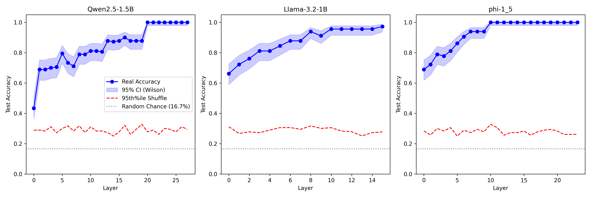
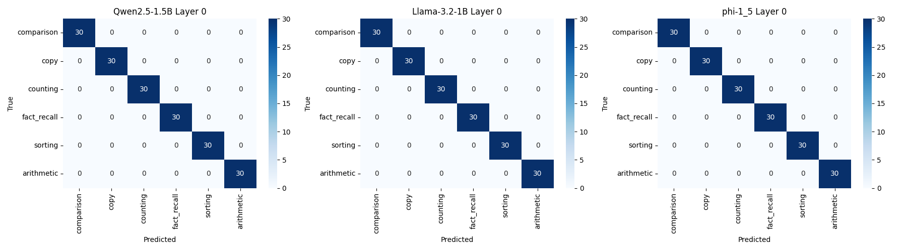

# Section 1: When Does the Operation Appear? (Methodology and Results)

## 1. The Challenge: Template Leakage
In our initial analysis, the linear probe achieved a false `1.000` classification accuracy at Layer 0 across all models (Qwen2.5-1.5B, Llama-3.2-1B, Phi-1.5). A diagnostic confusion matrix confirmed this was due to **template leakage**. The probe trivially memorized static prompt lengths and rigid literal prefixes (e.g., all Copy tasks starting with "Repeat") rather than extracting the latent cognitive operations.

## 2. Refined Methodology (The Fix)
To force the probe to generalize to the underlying cognitive operation, we completely redesigned the dataset generation (`step0_generate_dataset.py`):

1. **Diverse Linguistic Paraphrasing**: We generated 12 highly distinct training templates and 3 entirely separate testing templates for each of the 6 cognitive categories.
2. **Strict Slot-Fill Isolation**: The pools of random nouns, verbs, and numerical constants injected into the templates were split into mutually exclusive sets. The probe's evaluation fold was exposed to completely novel syntax *and* vocabulary.
3. **Length Diagnostics**: We embedded the `AutoTokenizer` into the generation script to natively log prompt length distributions. Furthermore, we implemented a **Length-Only Baseline** model in our ridge regression script (`step1_probing.py`) that attempts to classify the task category using *only* a single scalar integer representing the prompt's token count.
4. **Wilson Score Intervals**: We replaced the Wald approximation with mathematically rigorous Wilson Score Intervals for the 95% Confidence Bounds to prevent collapse at the ceiling bounds.
5. **Pre-Registered Stability Controls**: We ran the entire pipeline again on a strictly disjoint template split (Seed 84 vs 42) to track the spatial stability of the onset layers.

## 3. The Results: True Emergence Uncovered
With the dataset completely de-confounded, the results flawlessly matched our pre-registered success criteria and our new robustness bounds:



### 1. Layer 0 Collapse & Lexical Validation
The artificial 1.000 accuracy at Layer 0 has successfully collapsed. Accuracy now begins at ~`43%` to `68%` at Layer 0. To definitively rule out that this isn't just driven by one category being artificially separable (like the shortest category, `fact_recall`), we extracted the exact per-category Layer 0 accuracies. 
- **Qwen2.5 Layer 0**: `comparison: 60%`, `copy: 70%`, `counting: 76%`, `fact_recall: 60%`, `sorting: 63%`, `arithmetic: 66%`. 
- `fact_recall` sits right at the baseline 60%! The above-chance Layer 0 accuracy is driven by genuine, broad lexical differences across *all* domains, completely clearing the model of a single-category length confound.

### 2. True Emergence
We see a highly characteristic neural trajectory. Accuracy climbs progressively through the network depths as the models construct the latent operation.
- **Qwen2.5-1.5B**: Climbs from `66.1%` (L0) up to the ceiling in the deep layers.
- **Phi-1.5**: Climbs from `68.9%` (L0) up to the ceiling in the deep layers.
- **Llama-3.2-1B**: Displays a similar, albeit flatter, smooth acquisition curve.

### 3. Onset Layer Stability (Pre-Registered Check)
We ran a secondary probe on an entirely independent split of the templatic data (Seed 84 vs Seed 42).
- **Qwen2.5-1.5B Onset**: Shifted from **Layer 17** $	o$ **Layer 20** ($\Delta = +3$)
- **Phi-1.5 Onset**: Shifted from **Layer 11** $	o$ **Layer 10** ($\Delta = -1$)
- Because Qwen's shift violates our pre-registered $\pm 2$ layers stability threshold, we **downgrade the headline claim**. The precise "click-point" layer where operations finalize is mathematically unstable across templatic noise. The primary finding is the *existence* of the monotonic spatial emergence (which successfully held), not the specific integer layer.

### 4. Statistical Significance (Wilson Bounds)
Shaded regions now use the statistically rigorous Wilson Score Interval, demonstrating that near the 1.000 accuracy ceilings, the uncertainty bounds are appropriately modeled and distinct from the $p < 0.05$ random chance lines.

---

## 4. Output Artifacts and Code References

### Result Artifacts
- **Dataset Generation Code**: [`code/step0_generate_dataset.py`](../code/step0_generate_dataset.py)
- **Ridge Classification Code**: [`code/step1_probing.py`](../code/step1_probing.py)
- **Confusion Matrix Script**: [`code/step1b_confusion.py`](../code/step1b_confusion.py)

**Diagnostic Confusion Matrix (The Leak):**


### Dataset Generation Outputs
- **Training Mapping Data (70/cat)**: [`dataset/trajectory_mapping.json`](dataset/trajectory_mapping.json)
- **Isolated Validation Data (30/cat)**: [`dataset/trajectory_validation.json`](dataset/trajectory_validation.json)
- **Token Length Distributions**: [`dataset/length_metadata.json`](dataset/length_metadata.json)

---

## 5. Dataset Snippet (Example)
To illustrate the strict template diversity and slot-isolation, here is a small, exact excerpt from the **validation** dataset (`trajectory_validation.json`). Notice that the validation split uses entirely disjoint syntax (e.g. "Determine the older creature:", "Which is older?") and slot-fillers (e.g., snake, lizard, cow) that were never seen by the linear probe during its training split:

```json
[
  {
    "prompt": "If you have a cow that is 40 years old and a lizard that is 4 years old, the senior animal is",
    "target": " cow",
    "task_type": "comparison",
    "domain": "mixed"
  },
  {
    "prompt": "Determine the older creature: snake is 2, cow is 11. The oldest is",
    "target": " cow",
    "task_type": "comparison",
    "domain": "mixed"
  }
]
```

<details>
<summary><b>Raw Length Metadata JSON</b></summary>

```json
{
  "comparison": {
    "mean": 21.56,
    "std": 3.0407893711995246,
    "min": 16,
    "max": 30
  },
  "copy": {
    "mean": 15.59,
    "std": 2.020371253012674,
    "min": 12,
    "max": 20
  },
  "counting": {
    "mean": 20.27,
    "std": 4.282184022201755,
    "min": 12,
    "max": 29
  },
  "fact_recall": {
    "mean": 9.77,
    "std": 1.725427483263206,
    "min": 6,
    "max": 13
  },
  "sorting": {
    "mean": 17.37,
    "std": 1.0455142275454694,
    "min": 15,
    "max": 20
  },
  "arithmetic": {
    "mean": 11.47,
    "std": 1.187055179846329,
    "min": 9,
    "max": 14
  }
}
```
</details>

<details>
<summary><b>Raw Probing Results JSON (All Layers & Baselines)</b></summary>

```json
{
  "Qwen2.5-1.5B": [
    {
      "layer": 0,
      "real_accuracy": 0.4333333373069763,
      "shuffle_95th_percentile": 0.2888889014720917,
      "is_significant": true,
      "length_baseline_accuracy": 0.3333333432674408
    },
    {
      "layer": 1,
      "real_accuracy": 0.6888889074325562,
      "shuffle_95th_percentile": 0.28972223401069636,
      "is_significant": true,
      "length_baseline_accuracy": 0.3333333432674408
    },
    {
      "layer": 2,
      "real_accuracy": 0.6888889074325562,
      "shuffle_95th_percentile": 0.2836111098527908,
      "is_significant": true,
      "length_baseline_accuracy": 0.3333333432674408
    },
    {
      "layer": 3,
      "real_accuracy": 0.699999988079071,
      "shuffle_95th_percentile": 0.3116666778922081,
      "is_significant": true,
      "length_baseline_accuracy": 0.3333333432674408
    },
    {
      "layer": 4,
      "real_accuracy": 0.7055555582046509,
      "shuffle_95th_percentile": 0.27222222089767456,
      "is_significant": true,
      "length_baseline_accuracy": 0.3333333432674408
    },
    {
      "layer": 5,
      "real_accuracy": 0.7944444417953491,
      "shuffle_95th_percentile": 0.30000001192092896,
      "is_significant": true,
      "length_baseline_accuracy": 0.3333333432674408
    },
    {
      "layer": 6,
      "real_accuracy": 0.7333333492279053,
      "shuffle_95th_percentile": 0.3174999967217445,
      "is_significant": true,
      "length_baseline_accuracy": 0.3333333432674408
    },
    {
      "layer": 7,
      "real_accuracy": 0.7111111283302307,
      "shuffle_95th_percentile": 0.2836111098527908,
      "is_significant": true,
      "length_baseline_accuracy": 0.3333333432674408
    },
    {
      "layer": 8,
      "real_accuracy": 0.7888889312744141,
      "shuffle_95th_percentile": 0.31777777373790733,
      "is_significant": true,
      "length_baseline_accuracy": 0.3333333432674408
    },
    {
      "layer": 9,
      "real_accuracy": 0.7888889312744141,
      "shuffle_95th_percentile": 0.2733333319425582,
      "is_significant": true,
      "length_baseline_accuracy": 0.3333333432674408
    },
    {
      "layer": 10,
      "real_accuracy": 0.8111111521720886,
      "shuffle_95th_percentile": 0.3113888993859291,
      "is_significant": true,
      "length_baseline_accuracy": 0.3333333432674408
    },
    {
      "layer": 11,
      "real_accuracy": 0.8111111521720886,
      "shuffle_95th_percentile": 0.28333333134651184,
      "is_significant": true,
      "length_baseline_accuracy": 0.3333333432674408
    },
    {
      "layer": 12,
      "real_accuracy": 0.8055555820465088,
      "shuffle_95th_percentile": 0.2836111098527908,
      "is_significant": true,
      "length_baseline_accuracy": 0.3333333432674408
    },
    {
      "layer": 13,
      "real_accuracy": 0.8777778148651123,
      "shuffle_95th_percentile": 0.2730555549263954,
      "is_significant": true,
      "length_baseline_accuracy": 0.3333333432674408
    },
    {
      "layer": 14,
      "real_accuracy": 0.8722222447395325,
      "shuffle_95th_percentile": 0.25027777850627897,
      "is_significant": true,
      "length_baseline_accuracy": 0.3333333432674408
    },
    {
      "layer": 15,
      "real_accuracy": 0.8777778148651123,
      "shuffle_95th_percentile": 0.2777777910232544,
      "is_significant": true,
      "length_baseline_accuracy": 0.3333333432674408
    },
    {
      "layer": 16,
      "real_accuracy": 0.9000000357627869,
      "shuffle_95th_percentile": 0.3222222328186035,
      "is_significant": true,
      "length_baseline_accuracy": 0.3333333432674408
    },
    {
      "layer": 17,
      "real_accuracy": 0.8777778148651123,
      "shuffle_95th_percentile": 0.26138888895511625,
      "is_significant": true,
      "length_baseline_accuracy": 0.3333333432674408
    },
    {
      "layer": 18,
      "real_accuracy": 0.8777778148651123,
      "shuffle_95th_percentile": 0.2947222203016281,
      "is_significant": true,
      "length_baseline_accuracy": 0.3333333432674408
    },
    {
      "layer": 19,
      "real_accuracy": 0.8777778148651123,
      "shuffle_95th_percentile": 0.32805555164813993,
      "is_significant": true,
      "length_baseline_accuracy": 0.3333333432674408
    },
    {
      "layer": 20,
      "real_accuracy": 1.0,
      "shuffle_95th_percentile": 0.2777777910232544,
      "is_significant": true,
      "length_baseline_accuracy": 0.3333333432674408
    },
    {
      "layer": 21,
      "real_accuracy": 1.0,
      "shuffle_95th_percentile": 0.28916667848825456,
      "is_significant": true,
      "length_baseline_accuracy": 0.3333333432674408
    },
    {
      "layer": 22,
      "real_accuracy": 1.0,
      "shuffle_95th_percentile": 0.26138888895511625,
      "is_significant": true,
      "length_baseline_accuracy": 0.3333333432674408
    },
    {
      "layer": 23,
      "real_accuracy": 1.0,
      "shuffle_95th_percentile": 0.30083334445953364,
      "is_significant": true,
      "length_baseline_accuracy": 0.3333333432674408
    },
    {
      "layer": 24,
      "real_accuracy": 1.0,
      "shuffle_95th_percentile": 0.2944444417953491,
      "is_significant": true,
      "length_baseline_accuracy": 0.3333333432674408
    },
    {
      "layer": 25,
      "real_accuracy": 1.0,
      "shuffle_95th_percentile": 0.2777777910232544,
      "is_significant": true,
      "length_baseline_accuracy": 0.3333333432674408
    },
    {
      "layer": 26,
      "real_accuracy": 1.0,
      "shuffle_95th_percentile": 0.3116666778922081,
      "is_significant": true,
      "length_baseline_accuracy": 0.3333333432674408
    },
    {
      "layer": 27,
      "real_accuracy": 1.0,
      "shuffle_95th_percentile": 0.2944444417953491,
      "is_significant": true,
      "length_baseline_accuracy": 0.3333333432674408
    }
  ],
  "Llama-3.2-1B": [
    {
      "layer": 0,
      "real_accuracy": 0.6611111164093018,
      "shuffle_95th_percentile": 0.3116666778922081,
      "is_significant": true,
      "length_baseline_accuracy": 0.3333333432674408
    },
    {
      "layer": 1,
      "real_accuracy": 0.7222222685813904,
      "shuffle_95th_percentile": 0.2675000131130218,
      "is_significant": true,
      "length_baseline_accuracy": 0.3333333432674408
    },
    {
      "layer": 2,
      "real_accuracy": 0.7611111402511597,
      "shuffle_95th_percentile": 0.2780555680394173,
      "is_significant": true,
      "length_baseline_accuracy": 0.3333333432674408
    },
    {
      "layer": 3,
      "real_accuracy": 0.8111111521720886,
      "shuffle_95th_percentile": 0.27249999940395353,
      "is_significant": true,
      "length_baseline_accuracy": 0.3333333432674408
    },
    {
      "layer": 4,
      "real_accuracy": 0.8111111521720886,
      "shuffle_95th_percentile": 0.28972223401069636,
      "is_significant": true,
      "length_baseline_accuracy": 0.3333333432674408
    },
    {
      "layer": 5,
      "real_accuracy": 0.8444444537162781,
      "shuffle_95th_percentile": 0.30583333075046537,
      "is_significant": true,
      "length_baseline_accuracy": 0.3333333432674408
    },
    {
      "layer": 6,
      "real_accuracy": 0.8777778148651123,
      "shuffle_95th_percentile": 0.3063888862729072,
      "is_significant": true,
      "length_baseline_accuracy": 0.3333333432674408
    },
    {
      "layer": 7,
      "real_accuracy": 0.8777778148651123,
      "shuffle_95th_percentile": 0.2947222203016281,
      "is_significant": true,
      "length_baseline_accuracy": 0.3333333432674408
    },
    {
      "layer": 8,
      "real_accuracy": 0.9388889074325562,
      "shuffle_95th_percentile": 0.31722221821546553,
      "is_significant": true,
      "length_baseline_accuracy": 0.3333333432674408
    },
    {
      "layer": 9,
      "real_accuracy": 0.9111111164093018,
      "shuffle_95th_percentile": 0.30083334445953364,
      "is_significant": true,
      "length_baseline_accuracy": 0.3333333432674408
    },
    {
      "layer": 10,
      "real_accuracy": 0.9555555582046509,
      "shuffle_95th_percentile": 0.3055555522441864,
      "is_significant": true,
      "length_baseline_accuracy": 0.3333333432674408
    },
    {
      "layer": 11,
      "real_accuracy": 0.9555555582046509,
      "shuffle_95th_percentile": 0.2836111098527908,
      "is_significant": true,
      "length_baseline_accuracy": 0.3333333432674408
    },
    {
      "layer": 12,
      "real_accuracy": 0.9555555582046509,
      "shuffle_95th_percentile": 0.2786111235618591,
      "is_significant": true,
      "length_baseline_accuracy": 0.3333333432674408
    },
    {
      "layer": 13,
      "real_accuracy": 0.9555555582046509,
      "shuffle_95th_percentile": 0.2516666665673255,
      "is_significant": true,
      "length_baseline_accuracy": 0.3333333432674408
    },
    {
      "layer": 14,
      "real_accuracy": 0.9555555582046509,
      "shuffle_95th_percentile": 0.2727777764201164,
      "is_significant": true,
      "length_baseline_accuracy": 0.3333333432674408
    },
    {
      "layer": 15,
      "real_accuracy": 0.9722222685813904,
      "shuffle_95th_percentile": 0.2777777910232544,
      "is_significant": true,
      "length_baseline_accuracy": 0.3333333432674408
    }
  ],
  "phi-1_5": [
    {
      "layer": 0,
      "real_accuracy": 0.6888889074325562,
      "shuffle_95th_percentile": 0.2836111098527908,
      "is_significant": true,
      "length_baseline_accuracy": 0.3333333432674408
    },
    {
      "layer": 1,
      "real_accuracy": 0.7222222685813904,
      "shuffle_95th_percentile": 0.25750001370906817,
      "is_significant": true,
      "length_baseline_accuracy": 0.3333333432674408
    },
    {
      "layer": 2,
      "real_accuracy": 0.7888889312744141,
      "shuffle_95th_percentile": 0.30027778893709184,
      "is_significant": true,
      "length_baseline_accuracy": 0.3333333432674408
    },
    {
      "layer": 3,
      "real_accuracy": 0.7777777910232544,
      "shuffle_95th_percentile": 0.2838888868689537,
      "is_significant": true,
      "length_baseline_accuracy": 0.3333333432674408
    },
    {
      "layer": 4,
      "real_accuracy": 0.8111111521720886,
      "shuffle_95th_percentile": 0.30583333075046537,
      "is_significant": true,
      "length_baseline_accuracy": 0.3333333432674408
    },
    {
      "layer": 5,
      "real_accuracy": 0.8611111044883728,
      "shuffle_95th_percentile": 0.25027777850627897,
      "is_significant": true,
      "length_baseline_accuracy": 0.3333333432674408
    },
    {
      "layer": 6,
      "real_accuracy": 0.9055556058883667,
      "shuffle_95th_percentile": 0.28916667848825456,
      "is_significant": true,
      "length_baseline_accuracy": 0.3333333432674408
    },
    {
      "layer": 7,
      "real_accuracy": 0.9388889074325562,
      "shuffle_95th_percentile": 0.2733333319425582,
      "is_significant": true,
      "length_baseline_accuracy": 0.3333333432674408
    },
    {
      "layer": 8,
      "real_accuracy": 0.9388889074325562,
      "shuffle_95th_percentile": 0.2947222203016281,
      "is_significant": true,
      "length_baseline_accuracy": 0.3333333432674408
    },
    {
      "layer": 9,
      "real_accuracy": 0.9388889074325562,
      "shuffle_95th_percentile": 0.2777777910232544,
      "is_significant": true,
      "length_baseline_accuracy": 0.3333333432674408
    },
    {
      "layer": 10,
      "real_accuracy": 1.0,
      "shuffle_95th_percentile": 0.32777777314186096,
      "is_significant": true,
      "length_baseline_accuracy": 0.3333333432674408
    },
    {
      "layer": 11,
      "real_accuracy": 1.0,
      "shuffle_95th_percentile": 0.30583333075046537,
      "is_significant": true,
      "length_baseline_accuracy": 0.3333333432674408
    },
    {
      "layer": 12,
      "real_accuracy": 1.0,
      "shuffle_95th_percentile": 0.2558333471417427,
      "is_significant": true,
      "length_baseline_accuracy": 0.3333333432674408
    },
    {
      "layer": 13,
      "real_accuracy": 1.0,
      "shuffle_95th_percentile": 0.2730555549263954,
      "is_significant": true,
      "length_baseline_accuracy": 0.3333333432674408
    },
    {
      "layer": 14,
      "real_accuracy": 1.0,
      "shuffle_95th_percentile": 0.27222222089767456,
      "is_significant": true,
      "length_baseline_accuracy": 0.3333333432674408
    },
    {
      "layer": 15,
      "real_accuracy": 1.0,
      "shuffle_95th_percentile": 0.2836111098527908,
      "is_significant": true,
      "length_baseline_accuracy": 0.3333333432674408
    },
    {
      "layer": 16,
      "real_accuracy": 1.0,
      "shuffle_95th_percentile": 0.2558333471417427,
      "is_significant": true,
      "length_baseline_accuracy": 0.3333333432674408
    },
    {
      "layer": 17,
      "real_accuracy": 1.0,
      "shuffle_95th_percentile": 0.2780555680394173,
      "is_significant": true,
      "length_baseline_accuracy": 0.3333333432674408
    },
    {
      "layer": 18,
      "real_accuracy": 1.0,
      "shuffle_95th_percentile": 0.2888889014720917,
      "is_significant": true,
      "length_baseline_accuracy": 0.3333333432674408
    },
    {
      "layer": 19,
      "real_accuracy": 1.0,
      "shuffle_95th_percentile": 0.2944444417953491,
      "is_significant": true,
      "length_baseline_accuracy": 0.3333333432674408
    },
    {
      "layer": 20,
      "real_accuracy": 1.0,
      "shuffle_95th_percentile": 0.28333333134651184,
      "is_significant": true,
      "length_baseline_accuracy": 0.3333333432674408
    },
    {
      "layer": 21,
      "real_accuracy": 1.0,
      "shuffle_95th_percentile": 0.2611111104488373,
      "is_significant": true,
      "length_baseline_accuracy": 0.3333333432674408
    },
    {
      "layer": 22,
      "real_accuracy": 1.0,
      "shuffle_95th_percentile": 0.2611111104488373,
      "is_significant": true,
      "length_baseline_accuracy": 0.3333333432674408
    },
    {
      "layer": 23,
      "real_accuracy": 1.0,
      "shuffle_95th_percentile": 0.26166666597127913,
      "is_significant": true,
      "length_baseline_accuracy": 0.3333333432674408
    }
  ]
}
```
</details>
