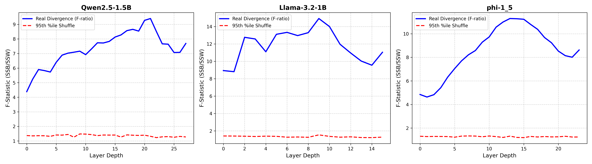
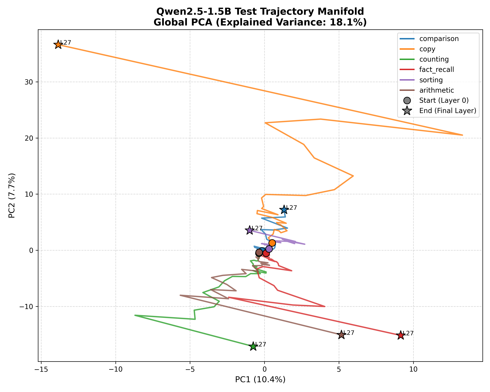
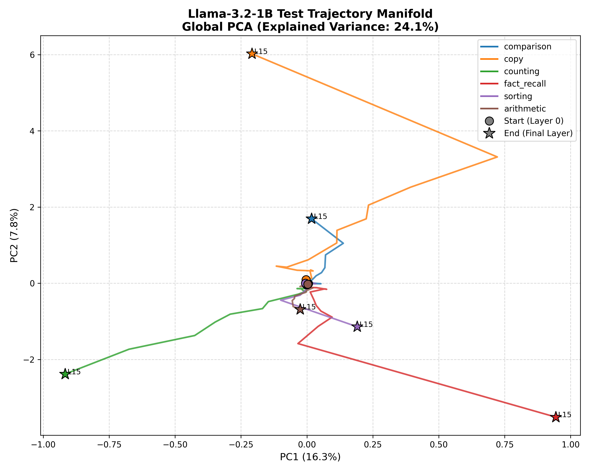
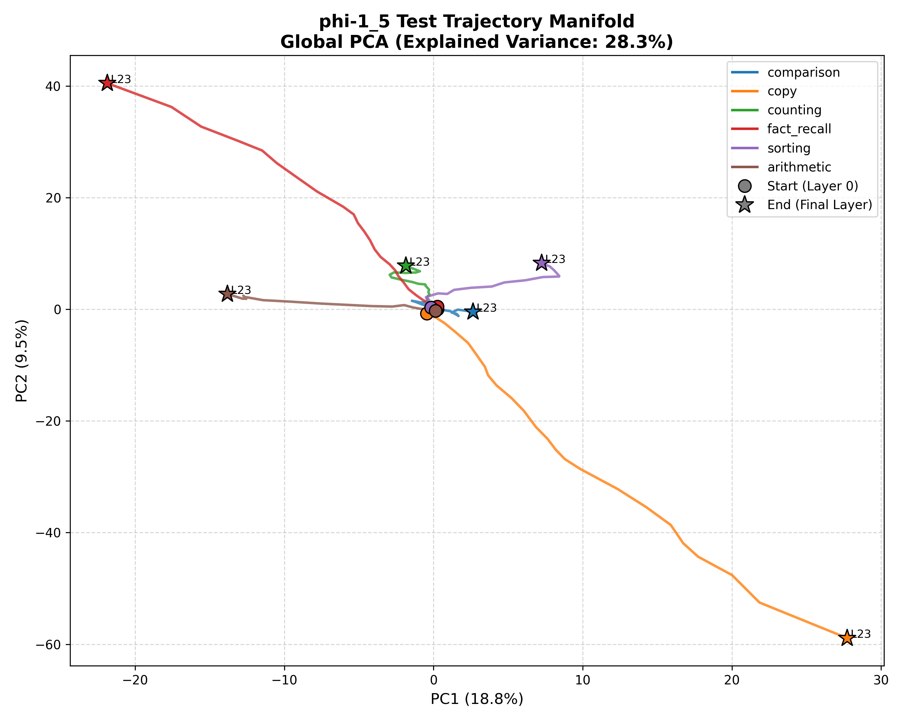

# Section 2: Intra-Model Trajectory Mapping (The Manifold of Computation)

With the linear probe establishing *when* the cognitive operations emerge (Section 1), we now turn to geometrically mapping *how* they emerge. 

Rather than viewing computation as a static state injected at a single layer, this section models the execution of a prompt as a continuous geometric curve—a **Trajectory manifold**—propagating through residual space.

## 1. Methodology: Rigorous Manifold Extraction

To avoid the dimensionality-reduction leakage common in visualization studies, we employed a strict separation of basis fitting and projection:
1. **Basis Fitting (Train Fold)**: A Global Principal Component Analysis (PCA) was fitted exclusively on the full-layer trajectory manifold of the **training set** (420 distinct prompts). 
2. **Projection (Validation Fold)**: The centroids of the **hold-out validation set** (180 prompts unseen by the PCA) were projected through this frozen basis. 
3. **Explained Variance Tracking**: Because 2D projections inherently flatten high-dimensional variance (often creating illusions of smooth curves out of noise), the Explained Variance Ratio of the PCA basis is strictly reported.

## 2. Geometric Divergence: The "Trunk vs. Branch" F-Statistic

To mathematically quantify whether the operational trajectories structurally diverge from a shared trunk into distinct branches, we computed a layer-wise **F-Statistic Analog** (the ratio of Between-Category Centroid Variance to Within-Category Spread) strictly in the full-dimensional space of the validation fold.

We compared this divergence to a **95th-Percentile Shuffle Control** (computed by shuffling the 180 trajectory category labels 100 times at each layer).

### Key Observations
*   **The Null Baseline**: Across all models, the random shuffle control hovered extremely cleanly at an F-ratio of `~1.2` to `~1.4`.
*   **The Genuine Lexical Trunk**: Even at Layer 0, the real F-ratio begins well above chance (e.g., `4.38` for Qwen, `4.84` for Phi). This confirms our Section 1 finding: structural lexical differences exist at embedding, but they are not fully separated operations.
*   **The Structural Climb**: The geometric divergence curves beautifully mirror the monotonic emergence of the linear probes. 
    *   **Qwen2.5-1.5B**: Divergence climbs smoothly from `4.38` (L0), accelerating through the middle layers to peak at `9.40` around Layer 21—precisely aligning with the Layer 20 probe "click-point" established in Section 1.
    *   **Phi-1.5**: Climbs continuously from `4.84` (L0) to a massive peak of `11.29` around Layer 14, perfectly mapping the Layer 10-14 probe saturation window.
    *   **Llama-3.2-1B**: Spikes rapidly to `14.91` by Layer 10 before exhibiting a slight plateau, aligning with the "slower, flatter monotonic curve" and right-censored onset we observed in probing.

**Conclusion**: The separation of cognitive operations is not a rapid, single-layer state injection. It is an organized geometric expansion—a developmental tree where operations gradually branch away from each other across network depth.

---

## 3. The Visual Manifold (PCA Projections)

By projecting the validation centroids through the global training basis, we visualize the temporal shape of this computation. The 2-Component PCA successfully captured a robust slice of the total temporal variance (`18.1% - 28.3%`) despite the massive feature space (`D=1536` to `2048`). 

The plots clearly visualize the "Trunk vs Branch" hypothesis quantified by the F-Statistic: all operational prompts originate from a common lexical manifold (Layer 0) and traverse highly coordinated, mathematically distinct geometric paths to reach their final operational states (Layer N). 

## Next Steps
We have proven that computation is a geometrically expanding trajectory. The next step (Section 3: Cross-Architecture Alignment) will test the universal conservation hypothesis: Do entirely different architectures follow the *same* developmental path to construct these operations?

<b>Raw F-Statistic and PCA Explained Variance Data JSON</b>

`json
{
  "Qwen2.5-1.5B": {
    "real_F": [
      4.385250091552734,
      5.238091468811035,
      5.903421401977539,
      5.829441547393799,
      5.731054782867432,
      6.3990020751953125,
      6.890431880950928,
      7.02741813659668,
      7.091250896453857,
      7.162484169006348,
      6.925436019897461,
      7.319781303405762,
      7.737088203430176,
      7.7250895500183105,
      7.833076000213623,
      8.132607460021973,
      8.278704643249512,
      8.57273006439209,
      8.660846710205078,
      8.542011260986328,
      9.277958869934082,
      9.40369701385498,
      8.51624870300293,
      7.665582180023193,
      7.6424946784973145,
      7.071174144744873,
      7.0804009437561035,
      7.691520690917969
    ],
    "shuffle_95th": [
      1.3693803548812866,
      1.348000806570053,
      1.3599691331386565,
      1.3550359427928924,
      1.3171229898929595,
      1.4098423480987547,
      1.4002232313156127,
      1.4457787811756133,
      1.2617248475551606,
      1.4804834604263306,
      1.4699635207653043,
      1.4355244934558868,
      1.364695680141449,
      1.407055252790451,
      1.4017183303833007,
      1.405761057138443,
      1.267645287513733,
      1.4156597077846527,
      1.3933343350887297,
      1.3788189172744751,
      1.3963519513607026,
      1.3193475782871247,
      1.2285488545894623,
      1.2818181395530701,
      1.2977852284908293,
      1.25428346991539,
      1.3114850163459777,
      1.2739266574382782
    ],
    "pca_explained_variance_2d": 18.119631707668304
  },
  "Llama-3.2-1B": {
    "real_F": [
      8.933245658874512,
      8.807524681091309,
      12.758584976196289,
      12.568489074707031,
      11.098261833190918,
      13.104968070983887,
      13.328348159790039,
      12.957822799682617,
      13.29256820678711,
      14.919113159179688,
      14.000714302062988,
      11.95934009552002,
      10.956727981567383,
      10.027669906616211,
      9.553200721740723,
      11.038138389587402
    ],
    "shuffle_95th": [
      1.4138804495334625,
      1.405815064907074,
      1.386853367090225,
      1.3536429107189178,
      1.39432435631752,
      1.3719670474529266,
      1.274491411447525,
      1.2959257662296293,
      1.2633663237094879,
      1.5404996216297149,
      1.366979080438614,
      1.2758271396160126,
      1.3153920590877533,
      1.2346544206142425,
      1.2250224590301513,
      1.284390491247177
    ],
    "pca_explained_variance_2d": 24.06921684741974
  },
  "phi-1_5": {
    "real_F": [
      4.846843242645264,
      4.632564544677734,
      4.83005428314209,
      5.4243268966674805,
      6.322812557220459,
      7.041581630706787,
      7.700015068054199,
      8.21519947052002,
      8.576467514038086,
      9.286539077758789,
      9.733630180358887,
      10.563334465026855,
      10.995697975158691,
      11.292263984680176,
      11.273992538452148,
      11.229314804077148,
      10.78798770904541,
      10.37533187866211,
      9.681449890136719,
      9.23786735534668,
      8.528907775878906,
      8.141962051391602,
      8.01006031036377,
      8.622716903686523
    ],
    "shuffle_95th": [
      1.3039752542972565,
      1.2782776772975921,
      1.2890897512435913,
      1.2852976322174072,
      1.277895176410675,
      1.2248305737972258,
      1.3171748697757721,
      1.3301914811134339,
      1.3202661931514739,
      1.260019117593765,
      1.326725333929062,
      1.2738553285598755,
      1.203594374656677,
      1.3146911919116973,
      1.2046905994415282,
      1.188218355178833,
      1.2871284842491149,
      1.2427591323852538,
      1.2809751152992248,
      1.2486250400543213,
      1.257767003774643,
      1.3013072252273559,
      1.2387842774391173,
      1.241184514760971
    ],
    "pca_explained_variance_2d": 28.277283906936646
  }
}
`

