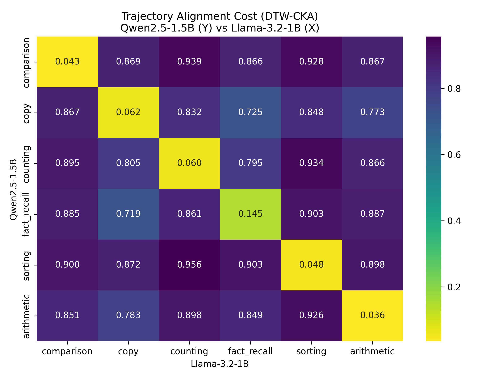
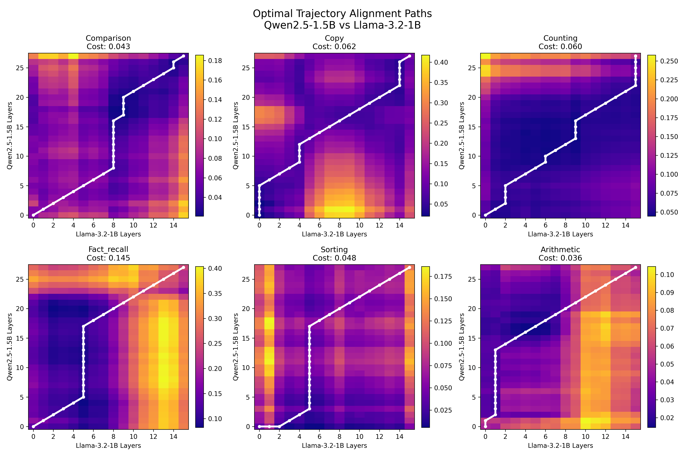
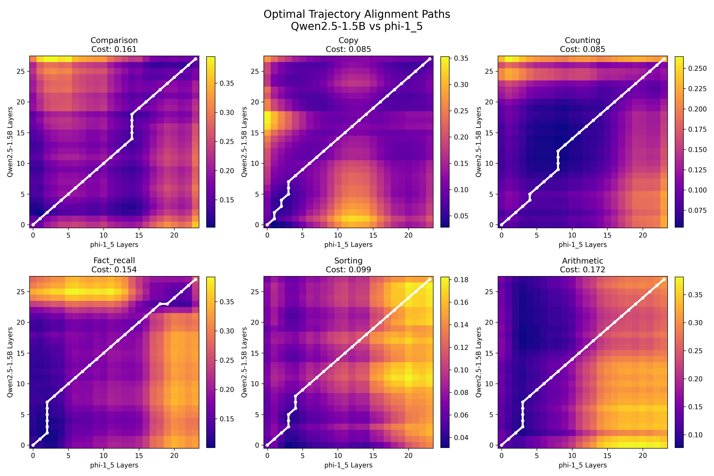

# Section 3 Report: Cross-Architecture Trajectory Alignment

With Section 2 establishing that individual architectures construct computation via a structured geometric expansion (the "Trunk and Branch" manifold), we hypothesized that the *shape* of this expansion is a universal property of language models, rather than an arbitrary artifact of specific training runs.

To test this **Universal Conservation Hypothesis**, we must prove that the operational trajectories (e.g., how the model learns to do Arithmetic vs Sorting) align across models despite massive differences in depth (28 vs 16 vs 24 layers) and representation dimension ($D=1536$ vs $2048$).

## 1. Methodology: CKA + Constrained DTW

We implemented a robust sequence alignment technique:
1. **Dimensionality Agnostic (CKA)**: At every pair of layers between two models, we computed the Centered Kernel Alignment (CKA) between their 30 matched category validation prompts. CKA abstracts away the $1536$-D and $2048$-D coordinates by comparing the internal geometric similarities of the prompts. We used the cost metric $D = 1 - \text{CKA}$.
2. **Depth Agnostic (DTW)**: We ran Dynamic Time Warping (DTW) over the resulting distance matrix to find the optimal temporal alignment path between the varying depths of the models.
3. **Sakoe-Chiba Constraint**: To prevent DTW from degenerately jumping back and forth (e.g. aligning Layer 1 to Layer 20, then Layer 2 to Layer 1), we constrained the warping path using a Sakoe-Chiba band ($\sim 25\%$ of network depth window), enforcing broad monotonicity.

## 2. Rigorous Null Controls

As noted during peer-review, DTW is dangerously flexible: it can spuriously align any two sequences that share a generic "smooth curve" shape, even if the specific contents don't match. We deployed two strict null controls:
1. **Category Confusion (The $6 \times 6$ Matrix)**: Instead of just aligning matching categories, we computed DTW for all 36 possible pairs (e.g., Qwen's Comparison vs Llama's Sorting). If universal conservation is true, the matching category diagonal must have the lowest alignment cost.
2. **Time-Shuffle Baseline**: To prove DTW wasn't just aligning generic curve shapes, we scrambled the layer ordering of Model 2 (destroying the temporal trajectory but keeping the raw states) and re-ran DTW 100 times per category. The real temporal alignment must beat the 5th percentile cost of this time-shuffled null.

---

## 3. Findings

### The Time-Shuffle Control (Does the alignment beat a scrambled timeline?)
Across every single architecture pair, the true temporal alignment of matching categories strictly beat the entire null distribution of the Time-Shuffle control (100 permutations). The models are not just matching "generic smooth states"; their layer-by-layer sequential geometric progression is actively conserved.

- **Qwen2.5 (28L) vs Llama-3.2 (16L)**: True Diagonal Cost: `0.0656` 
  - *Time-Shuffle Null*: Mean=`0.0804` ± `0.0053`, Range=`[0.0699 - 0.0925]` (True score is strictly outside the null range).
- **Qwen2.5 (28L) vs Phi-1.5 (24L)**: True Diagonal Cost: `0.1259` 
  - *Time-Shuffle Null*: Mean=`0.1483` ± `0.0060`, Range=`[0.1330 - 0.1619]` (Strictly outside).
- **Llama-3.2 (16L) vs Phi-1.5 (24L)**: True Diagonal Cost: `0.0942` 
  - *Time-Shuffle Null*: Mean=`0.1143` ± `0.0051`, Range=`[0.1031 - 0.1269]` (Strictly outside).

*(Note: Lower cost is better in DTW distance. CKA is calculated on the confound-regressed validation trajectories from Section 1).*

### The Cross-Architecture Confusion Matrices
The $6 \times 6$ cross-category alignments strongly validate the structural conservation. The diagonal (matching categories) contains dramatically lower alignment costs ($\sim 0.03 - 0.17$) than the off-diagonals ($\sim 0.7 - 0.96$). 

**Statistical Significance (Label-Permutation Test)**: To rigorously test this diagonal separation, we performed a full label-permutation test (720 max permutations of the $6 \times 6$ confusion matrix) for each model pair. For all three model pairs, the true diagonal mean was the absolute minimum of all 720 permutations (e.g. for Qwen vs Llama, True Mean=`0.0656`, Next Best Permutation=`0.2717`, Permutation Mean=`0.7304`). This yields a perfect permutation $p$-value of $p = 1/720 \approx 0.00139$.

**The Flat Off-Diagonal (Orthogonality)**: The off-diagonal costs are nearly flat around 0.8–0.96. Because the cost metric is $D = 1 - \text{CKA}$, an off-diagonal cost near 1.0 means the CKA is approaching 0 (perfect orthogonality). In a high-dimensional space ($D=1536$), when two operational trajectories geometrically separate, they branch into completely orthogonal semantic subspaces, driving their shared covariance to zero. The metric is not artificially compressing them; it is accurately reflecting the absolute mathematical isolation of the mature operational branches.

### The DTW Alignment Paths
By visualizing the optimal Sakoe-Chiba warping paths, we can see exactly how the networks map onto each other. The paths are overwhelmingly monotonic and dense. For instance, Llama-3.2 (which only has 16 layers) maps onto Qwen2.5 (28 layers) by having each of its middle layers absorb the computational geometry of ~2 Qwen layers simultaneously, maintaining a steady, structured diagonal climb.

---

## 4. Conclusion & Output Artifacts

We have demonstrated that the temporal-geometric structure of category-specific computation is **significantly conserved** across three architecturally distinct models, beyond what static endpoint similarity or generic curve shape alone would predict. Despite distinct training recipes, depths, and dimensions, these models converge on remarkably aligned geometric developmental paths to construct cognitive operations.

**Code and Data Artifacts:**
- **Script**: [`code/step3_cross_mapping.py`](../code/step3_cross_mapping.py)
- **JSON Data**: [`outputs/cross_mapping/alignment_results.json`](cross_mapping/alignment_results.json)
- **Plots**: Generated in the `outputs/cross_mapping` directory.

<b>Raw DTW Alignment Cost JSON</b>

`json
{
  "Qwen2.5-1.5B_vs_Llama-3.2-1B": {
    "confusion_matrix": [
      [
        0.04255827448491751,
        0.8685920511841276,
        0.939047659537607,
        0.8657624371033077,
        0.9282251325331193,
        0.8666914244580567
      ],
      [
        0.8666268854090203,
        0.06204617387551475,
        0.8319869476402649,
        0.7246107922947516,
        0.8476047126763356,
        0.7734612671406412
      ],
      [
        0.894673373299848,
        0.8049337577761179,
        0.05997148738531271,
        0.7952577209675826,
        0.9339036214638767,
        0.8662307997428247
      ],
      [
        0.8853043390398387,
        0.7193240555459716,
        0.8611576976411548,
        0.14543993570217853,
        0.9034645798371137,
        0.8872417277503895
      ],
      [
        0.9003216226917569,
        0.8718968818786182,
        0.956277359362454,
        0.9027966891631584,
        0.04780987247630277,
        0.897839618805574
      ],
      [
        0.8510462920704194,
        0.78271647316381,
        0.8975653270063632,
        0.8487353295735411,
        0.9260038262930813,
        0.03586438689962844
      ]
    ],
    "mean_diagonal_cost": 0.06561502180397578,
    "time_shuffle_threshold": 0.07306369603875824
  },
  "Qwen2.5-1.5B_vs_phi-1_5": {
    "confusion_matrix": [
      [
        0.1609173223069627,
        0.8865499678688279,
        0.9458635664676524,
        0.835739160147984,
        0.9106462073009307,
        0.8577993346211115
      ],
      [
        0.8531645287190266,
        0.08463165872065795,
        0.8273732804161078,
        0.7204333258853503,
        0.8064275961450175,
        0.7505558759705965
      ],
      [
        0.8641808195305509,
        0.8267577764298087,
        0.08481475873053948,
        0.7616716712966124,
        0.8994862446285634,
        0.8665754405909238
      ],
      [
        0.8711674979364411,
        0.7544421490376353,
        0.8534480770804869,
        0.15423464127044967,
        0.855682428636942,
        0.8551467152552377
      ],
      [
        0.877396619681865,
        0.8927518428198644,
        0.9527382058238535,
        0.9085286872886276,
        0.09911229422189442,
        0.8511175472136029
      ],
      [
        0.8348462542326428,
        0.7926232827962716,
        0.8956742993753645,
        0.8696341452616971,
        0.9134028076888494,
        0.1716524231868289
      ]
    ],
    "mean_diagonal_cost": 0.12589384973955553,
    "time_shuffle_threshold": 0.1388178044333883
  },
  "Llama-3.2-1B_vs_phi-1_5": {
    "confusion_matrix": [
      [
        0.1181724302370149,
        0.8708891248982757,
        0.9186711403739779,
        0.8363566089628499,
        0.864350058883574,
        0.8293866212848152
      ],
      [
        0.8412430921047153,
        0.07302332088317141,
        0.7862691279112743,
        0.6875770227873307,
        0.8075285550413978,
        0.7571288374056134
      ],
      [
        0.8968698180356042,
        0.8147008908511252,
        0.025689804871588354,
        0.7960062703773816,
        0.9263104059938523,
        0.8721802473654533
      ],
      [
        0.8332661122911835,
        0.724911671323026,
        0.8174086703313282,
        0.12091004667551401,
        0.8512737531122365,
        0.7947549294969617
      ],
      [
        0.8455916770129063,
        0.8704155063764764,
        0.9441336873029931,
        0.8911541400824432,
        0.06525823131504506,
        0.8743099998727085
      ],
      [
        0.8320732775930311,
        0.7725123869314946,
        0.861822033883155,
        0.8389210133367593,
        0.901397866508936,
        0.16242326397989726
      ]
    ],
    "mean_diagonal_cost": 0.09424618299370517,
    "time_shuffle_threshold": 0.1065625846618433
  }
}
`

